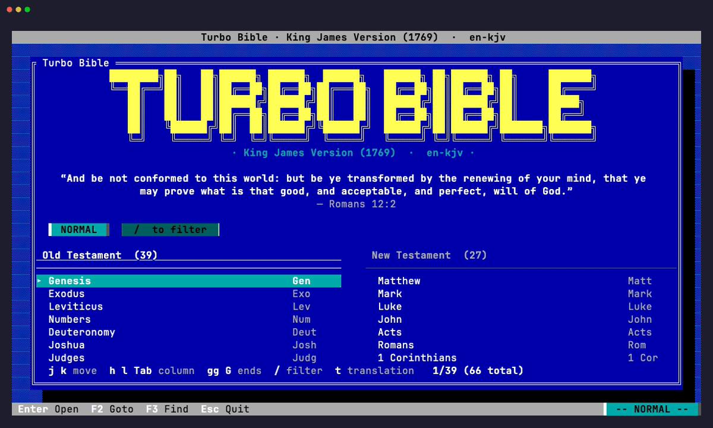

# turbo-bible

Turbo Vision–styled terminal Bible reader written in Rust. Ships three
public-domain translations:

| Code        | Title                       | Language |
| ----------- | --------------------------- | -------- |
| `en-kjv`    | King James Version (1769)   | English  |
| `nb-1930`   | Bibelen 1930 (Bokmål)       | Norwegian |
| `es-rv1909` | Reina-Valera 1909           | Spanish  |



For a narrative walk-through of every feature, see
[`docs/USAGE.md`](docs/USAGE.md). The keymap and config layout below are
the reference; the guide is the tutorial.

All three are imported from [`scrollmapper/bible_databases`][scrollmapper] at
a pinned commit by `turbo-bible import`.

[scrollmapper]: https://github.com/scrollmapper/bible_databases

## Setup

Run the importer once to populate the database:

```sh
turbo-bible import
```

It writes to `$XDG_DATA_HOME/turbo-bible/bible.sqlite` (typically
`~/.local/share/turbo-bible/bible.sqlite`), backs up any pre-existing DB
to `~/.local/share/turbo-bible/backups/`, caches scrollmapper downloads
in `~/.cache/turbo-bible/scrollmapper/`, then rebuilds the FTS5 index.
Pass `--only en-kjv` to import a subset, or `--db /custom/path.sqlite`
to relocate.

## Run

```sh
cargo run --release
# Pick a translation explicitly:
cargo run --release -- --translation nb-1930
# Or jump straight into a passage:
cargo run --release -- --book JHN --chapter 3
```

Translation resolution at startup:

```
--translation flag  >  config.default_translation  >  first translation in DB
```

First launch rebuilds the FTS5 index with a diacritic-folding tokenizer and a
prefix index — takes ~1 s and is cached.

## Switching translations

Press `t` (or `F5`) in either the splash or the reading view to open the
**Translations** picker. `j`/`k`/`Enter`/`Esc` work as in any dialog. The
selected translation becomes the default for the next launch.

## Keymap

### Reading

| Keys | Action |
| --- | --- |
| `h` / `H` / `←` | previous chapter |
| `l` / `L` / `→` | next chapter |
| `[b` / `]b` | previous / next book |
| `j` / `↓` | next verse (cursor) |
| `k` / `↑` | previous verse |
| `Ctrl-D` / `Ctrl-U` | half-page down / up |
| `Ctrl-F` / `Ctrl-B` / `Space` | page down / up |
| `gg` / `G` | first / last verse |
| `Ctrl-O` / `Ctrl-I` | jump back / forward in history |

Count prefixes work: `5j` moves the cursor down 5 verses.

### Search & navigation

| Keys | Action |
| --- | --- |
| `F2` / `:` | Goto dialog (`Mark 1:1`, `MRK 1`, `Génesis 1`) |
| `F3` / `/` | Find dialog (FTS5; BM25-ranked) |
| `K` | Footnote / cross-reference popup for current verse |
| `t` / `F5` | Translations picker |
| `M` / `F4` | Bookmarks |
| `b` | toggle bookmark on cursor verse (or visual selection) |
| `v` / `V` | enter / exit visual selection mode |
| `T` | toggle two-line / single-line verse layout |
| `Tab` | toggle References sidebar |
| `y` | copy current verse + reference to clipboard |
| `F1` | help |
| `Esc` | back to splash (or close dialog) |
| `q` / `ZZ` / `ZQ` / `:q` | quit |
| `:h` / `:help` | open help |

### Splash screen

The TURBO BIBLE splash is the home screen. It shows the title art, a daily
verse, and a filterable book picker. The book list is split into two columns:
**Old Testament** (39 books) on the left and **New Testament** (27 books) on
the right.

**NORMAL** (default):

- `h` / `←` and `l` / `→`: focus OT / NT column (or `Tab` to toggle)
- `j` / `k`: move cursor within the focused column
- `gg` / `G`: top / bottom of the focused column (or Continue / last book)
- `Ctrl-D` / `Ctrl-U` / `Ctrl-F` / `Ctrl-B`: half-page / full-page
- Count prefix works: `5j` / `10G`
- `Enter` / `o`: open the selected book (or "Continue")
- `/`: enter FILTER mode
- `:` / `F2` / `F3` / `t`: Goto / Goto / Find / Translations dialogs
- `q` / `Esc`: quit

**FILTER**:

- Type to narrow the list; `Enter` accepts, `Esc` clears, `Ctrl-U` wipes.

The **References sidebar** sits to the right of the reading pane and
auto-follows the cursor verse. It shows the parallel-passage refs, footnote
bodies, and cross-references for the current verse — appears when the
terminal is at least ~120 columns wide.

### Inside dialogs

`Enter` confirms, `Esc` cancels. In Find, `↑`/`↓` navigate results and
`Enter` jumps the cursor to the matched verse (not just the chapter).
Goto with a verse component — `John 3:16`, `Sal 23,4` — likewise lands
the cursor on the verse. In the Footnote popup, `↑`/`↓` selects a
cross-reference and `Enter` follows it.

## State and configuration

XDG-style paths:

| Path                                    | Purpose |
| --------------------------------------- | ------- |
| `~/.config/turbo-bible/state.toml`      | last-position bookkeeping (book/chapter/verse) — written on quit |
| `~/.config/turbo-bible/bookmarks.toml`  | saved bookmarks |
| `~/.config/turbo-bible/config.toml`     | user preferences (theme, keybindings, reading layout) |
| `~/.local/share/turbo-bible/bible.sqlite` | the verse database (populated by the importer) |
| `~/.local/share/turbo-bible/backups/`   | backups of the DB before re-imports |
| `~/.cache/turbo-bible/scrollmapper/`    | cached downloads from scrollmapper |

Legacy `state.json` / `bookmarks.json` under `~/.config/turbo-bible/` are
migrated to TOML on first launch and removed.

### `config.toml` layout

```toml
default_translation = "en-kjv"

[reading]
two_line_verses  = true   # initial layout (T to toggle)
show_sidebar     = true   # initial (Tab to toggle)
show_daily_quote = true   # splash "verse of the day" on/off
max_width        = 80     # reading pane max width in cols

[theme]
# CGA palette by default. Any 24-bit hex color works.
blue         = "#0000aa"
cyan         = "#00aaaa"
bright_white = "#ffffff"
light_grey   = "#aaaaaa"
dark_grey    = "#555555"
yellow       = "#ffff55"
hotkey_red   = "#aa0000"
black        = "#000000"

[keys]
# Additive triggers — vim-style defaults always remain functional.
# Key syntax: "q", "Ctrl-d", "Shift-Tab", "Alt-x", "F5", "Esc", "Enter",
#             "Space", "Tab", "Up"/"Down"/"Left"/"Right",
#             "Home"/"End", "PageUp"/"PageDown", "Backspace"/"Delete".
open_translations = ["F5"]    # example: adds F5 as an alias for `t`
quit              = ["Ctrl-q"]
```

Multi-key chords (`gg`, `[b`, `]b`, `ZZ`) and the count prefix are not
remappable.

## Notes on terminals

The Turbo Vision look uses 24-bit RGB and a `▒` dither. Recent terminals
render it cleanly (iTerm2, Ghostty, Alacritty, WezTerm, Kitty, modern xterm).
macOS `Terminal.app` has flaky Alt-key handling; prefer iTerm2 or Ghostty.

## Layout

- `src/main.rs` — arg parsing, terminal setup, main loop, mode dispatch
- `src/db.rs` — rusqlite + prepared statements, schema, FTS5 rebuild
- `src/render.rs` — chapter render pass (heading interleave, markers)
- `src/nav.rs` — book/chapter walking
- `src/search.rs` — FTS5 query, BM25 ranking, byte-offset highlights
- `src/keys.rs` — vim sequence state machine with count prefix + user bindings
- `src/state.rs` — `state.toml` load/save + JSON/legacy-translation migration
- `src/config.rs` — `config.toml` schema (theme, keys, reading)
- `src/bookmark.rs` — `bookmarks.toml` load/save
- `src/theme.rs` — runtime-configurable CGA palette + drop-shadow primitive
- `src/ui/translations.rs` — translation picker dialog
- `src/ui/` — desktop, menubar, statusbar, passage view, sidebar, dialogs

## What's not in v1

- Poetry indentation (Psalms render as prose)
- Inline (mid-verse) footnote markers — markers sit at end of verse
- Side-by-side translation diff
- Mouse-driven verse selection (clicks on menu / status bar work)
