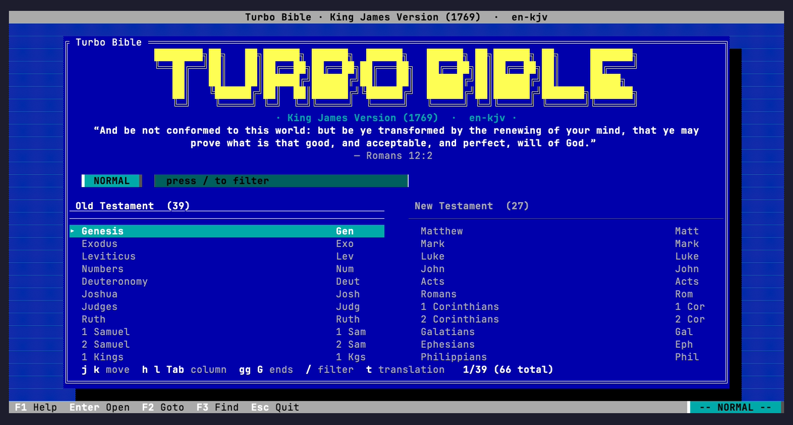
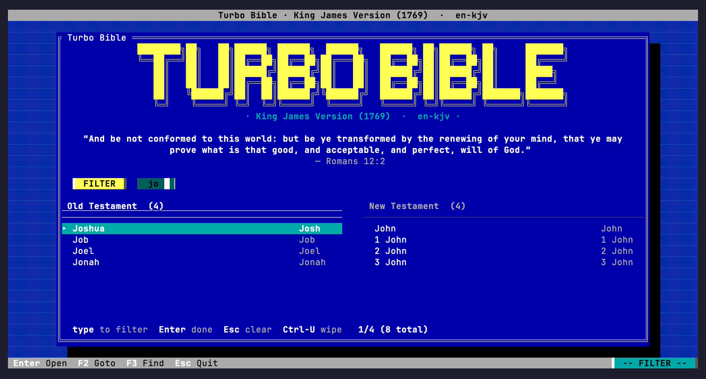
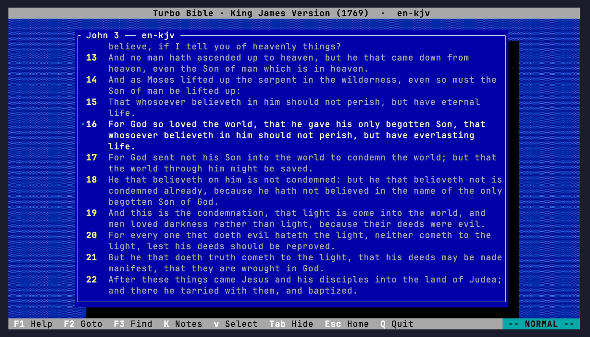
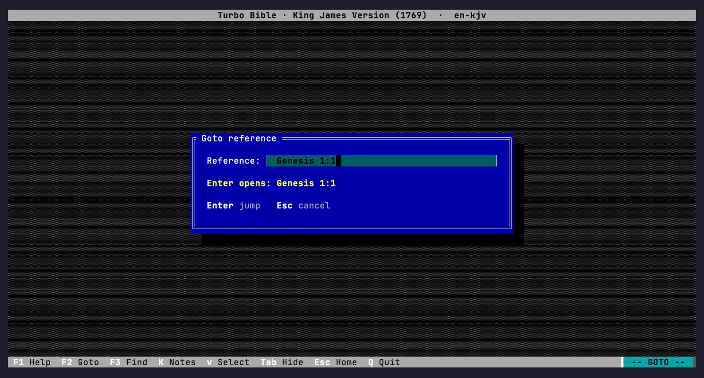
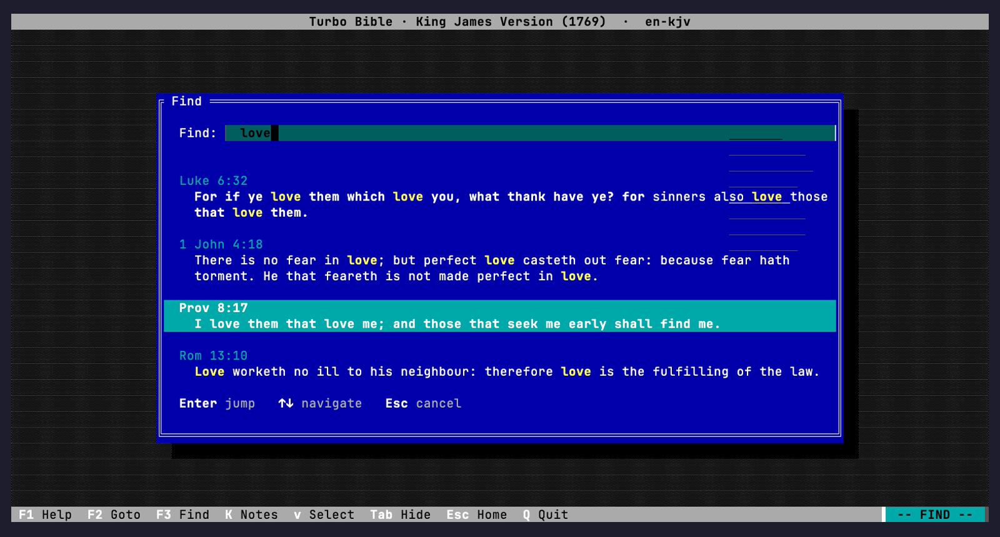
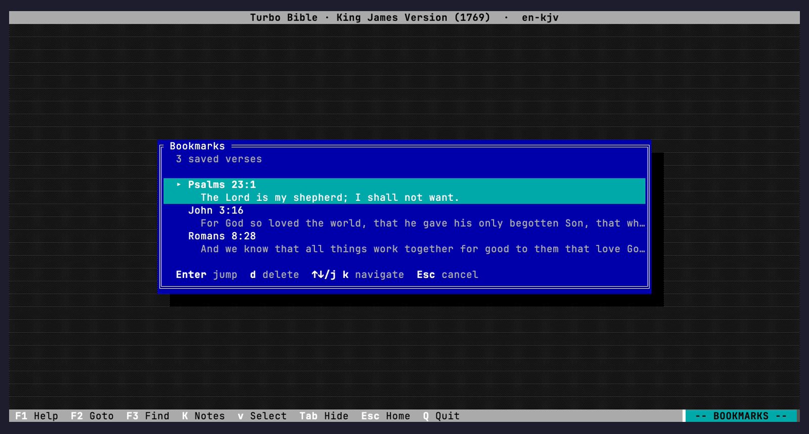
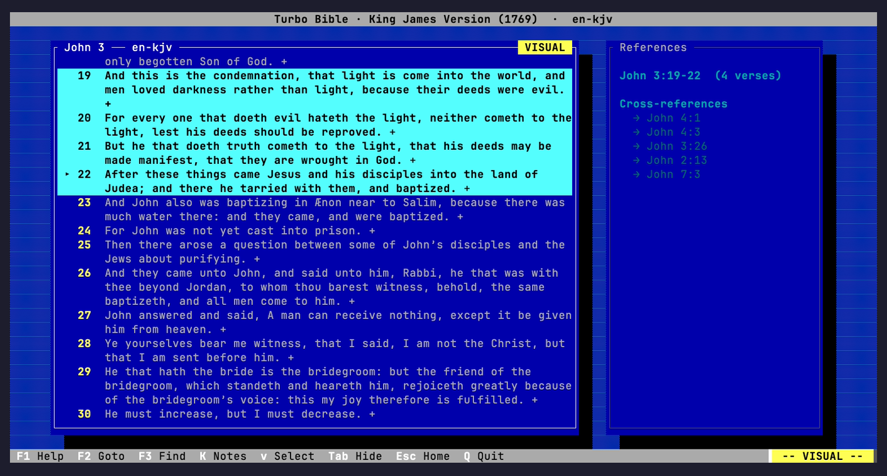
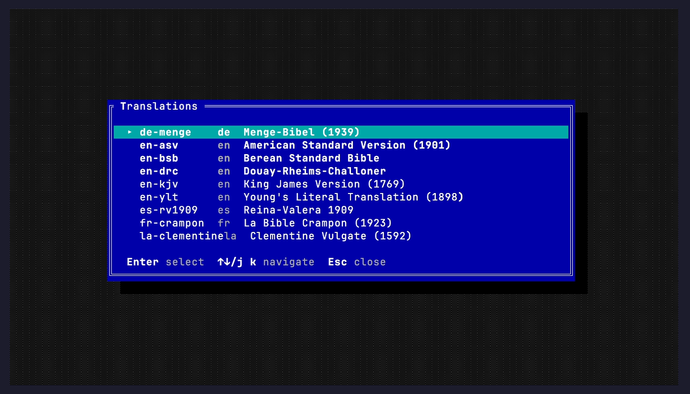
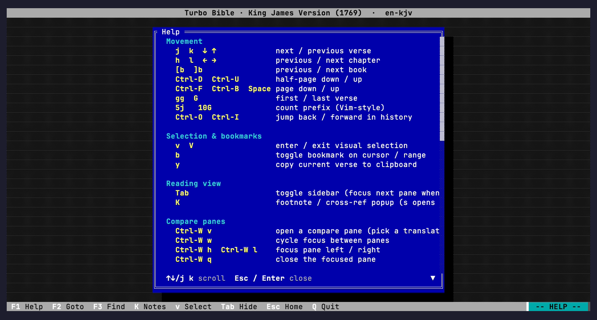

# turbo-bible — user guide

A narrative walk-through of the features. For the terse keymap and config
reference, see the [README](../README.md). For an animated overview, see
[`demo/demo.gif`](../demo/demo.gif).

## Contents

1. [First launch](#first-launch)
2. [The splash screen](#the-splash-screen)
3. [The reading view](#the-reading-view)
4. [Moving around](#moving-around)
5. [Goto: jumping to a reference](#goto-jumping-to-a-reference)
6. [Find: full-text search](#find-full-text-search)
7. [Bookmarks](#bookmarks)
8. [Footnotes and cross-references](#footnotes-and-cross-references)
9. [Visual selection and yank](#visual-selection-and-yank)
10. [Translations](#translations)
11. [Comparing translations side by side](#comparing-translations-side-by-side)
12. [Help: built-in keymap cheat sheet](#help-built-in-keymap-cheat-sheet)
13. [Customizing keys, theme, and layout](#customizing-keys-theme-and-layout)
14. [Where things live](#where-things-live)

## First launch

The King James Version is embedded in the binary and extracted into
`$XDG_DATA_HOME/turbo-bible/translations/` on first launch, so there is
nothing to install before reading. Launch with `cargo run -p turbo-bible
--release`. The first launch rebuilds the FTS5 index with a
diacritic-folding tokenizer and a prefix index. This takes about a
second and is cached — subsequent launches start instantly. (The other
ten translations and the shared cross-references DB download from GitHub
Releases the first time you open them.)

You land on the splash screen. If you'd rather skip it and jump straight
into a passage, pass `--book` and `--chapter`:

```sh
cargo run -p turbo-bible --release -- --book JHN --chapter 3
cargo run -p turbo-bible --release -- --translation nb-1930 --book GEN
```

Translation resolution at startup follows this order:

```
--translation flag  >  config.default_translation  >  first translation in DB
```

## The splash screen



The splash is the home screen. It has three parts:

- **Title art and version banner.** The Turbo Vision look uses 24-bit RGB and
  a `▒` dither; recent terminals render it cleanly.
- **Daily verse.** A deterministic verse-of-the-day, drawn from the current
  translation. Disable it with `[reading] show_daily_quote = false` in
  `config.toml` if you find it distracting.
- **Book picker.** Two columns: Old Testament on the left (39 books), New
  Testament on the right (27). The columns scroll independently. If you had
  a book open last time, a `Continue` entry appears at the top of the
  left column.

In **NORMAL** mode (the default), `h`/`l` (or `Tab`) switches between the
two columns, `j`/`k` moves the cursor inside the focused column, and
`Enter` (or `o`) opens the book at chapter 1. Count prefixes work — `5j`
moves the cursor down five entries; `10G` jumps to the tenth book.

Press `/` to enter **FILTER** mode. Type to narrow both columns
simultaneously; the match is a case-insensitive substring against the
book's name, abbreviation, or OSIS code. `Enter` exits filter mode keeping
the narrowed view; `Esc` clears the filter; `Ctrl-U` wipes the input. From
filter mode, `Enter` does **not** open the focused book — it just exits
filter mode. Press `Enter` again (now in NORMAL mode) to actually open.



The dialogs are reachable directly from the splash too: `:` or `F2` for
Goto, `/` is filter on splash but `F3` for Find from anywhere,
`t` or `F5` for Translations.

## The reading view



Opening a book lands you at chapter 1, verse 1. The layout has four
regions:

- **Title bar** (top): book name, chapter, and translation code.
- **Passage pane** (centre-left): the chapter text. Verses are numbered.
  When the terminal is narrower than ~120 columns, this pane uses the
  full width.
- **References sidebar** (right): only visible when the terminal is at
  least ~120 columns wide. Shows the current section's parallel-passage
  reference (the typeset `r`-style heading), all footnote bodies for the
  cursor verse, and a cross-references list. Toggle with `Tab`.
- **Status bar** (bottom): mode indicator (NORMAL / VISUAL / FILTER /
  HELP / GOTO / FIND / TRANSLATIONS / BOOKMARKS), the current reference,
  and shortcut chips.

A highlighted line (the **cursor verse**) tracks which verse "follows" the
sidebar, gets bookmarked when you press `b`, and is the target of `y`
(yank). It is independent of the *viewport* — `Ctrl-D`/`Ctrl-U` and
`Ctrl-F`/`Ctrl-B` page the view without moving the cursor, while `j`/`k`
move the cursor (and may scroll the view to keep it on screen).

- `Tab` toggles the sidebar — respects the `[reading] show_sidebar`
  default from `config.toml`.

## Moving around

Vim-style. Counts work everywhere a digit could go; the count prefix is
not remappable.

| Scope | Keys |
| --- | --- |
| Verse | `j` / `k` (or `↓` / `↑`); `gg` / `G` for first / last |
| Chapter | `h` / `l` (or `←` / `→`); wraps to neighbouring book at chapter boundaries |
| Book | `[b` / `]b` |
| Page | `Ctrl-F` / `Ctrl-B` (full) or `Ctrl-D` / `Ctrl-U` (half); `Space` is page down |
| History | `Ctrl-O` jumps back to where you came from; `Ctrl-I` re-does the jump |

History is populated by every Goto / Find / bookmark jump and by chapter-
and book-level navigation. It is in-memory — quitting clears it.

## Goto: jumping to a reference



`F2` or `:` opens the Goto dialog. Type a free-text reference and hit
`Enter`. The parser accepts any of these forms:

- **OSIS code**: `JHN`, `MAT 5`, `GEN 1:1`
- **Abbreviation**: `Jn 3:16`, `Mark 1`, `1 Mos 1` (Norwegian "1 Mosebok")
- **Full name** (any language in the DB): `Markus 3:14`, `Génesis 1`,
  `Johannes 3,16`, `1. Mosebok 5`
- **Lowercase, mixed-case, accents** — all fine

Matching is case-insensitive and works on any of the book's three string
fields: full name, abbreviation, OSIS code. The longest matching prefix
wins, so `1 John` is preferred over `1` matching nothing. A word boundary
is required after the book name (space, digit, or end-of-input) so `Job`
won't accidentally match `Joh` (John).

For the chapter/verse separator, all four are accepted: `:`, `,`, `.`,
and a plain space. Norwegian convention is `,` (`Sal 23,4`); English is
`:` (`Ps 23:4`).

You can also use the dialog for the two `ex:` commands:

- `:q`, `:quit`, `:exit` — quit
- `:h`, `:help` — open help

The dialog shows a live preview of where you'd land, so it's easy to spot
when the parser doesn't understand your input (preview empty = no match).

## Find: full-text search



`F3` or `/` (from the reading view) opens Find. Type a query; results
populate as you type, ranked by BM25. `↑` / `↓` browse the result list,
`Enter` jumps the cursor to the matched verse, `Esc` cancels.

The query is tokenized on whitespace. Each token is required (AND-ed):
`love peace` matches verses containing **both** words. Tokens are quoted
internally, so FTS5 operator characters (`*`, `^`, `"`, `OR`, `NEAR`, …)
in your input are treated as literal text rather than being interpreted.

The tokenizer folds diacritics, so `nino` matches "niño", `genesis`
matches "Génesis", `Bokmaal` matches "Bokmål". The prefix index means
partial token starts work — `lov` would only match a literal token "lov"
because the AND tokens are exact word matches; for prefix-style queries
you can rely on the FTS5 prefix index by adding `*` literally (it gets
quoted and won't actually do prefix matching today; this is intentional
to keep queries simple and predictable).

Results are scoped to the **current translation**. Switch translations
first if you want to search a different one.

## Bookmarks



Two-key workflow: `b` toggles a bookmark on the cursor verse;
`M` (or `F4`) opens the bookmarks list. In the list, `↑`/`↓` or `j`/`k`
navigate, `Enter` jumps to the bookmark, `d` deletes the highlighted
entry, `Esc` closes.

If you've entered visual selection mode (`v`) and have a range selected,
`b` bookmarks the entire range — useful for marking a passage like
"Romans 12:1–8" as one entry. Otherwise `b` toggles a single-verse
bookmark.

Bookmarks include the translation code, so the same verse in two
translations counts as two bookmarks. The list is sorted in canonical
order (Genesis → Revelation, then ascending chapter/verse).

State persists to `~/.config/turbo-bible/bookmarks.toml`. Edit the file
by hand if you want to bulk-import or relabel — the format is stable.

## Footnotes and cross-references

The References sidebar follows the cursor verse and shows:

1. **Parallel passage** — if the current section has a typeset
   parallel-reference heading (e.g. "Mark 1:1–8 par. Mt 3:1–12,
   Lk 3:1–18"), it appears at the top of the sidebar.
2. **Footnotes** — full text of every footnote anchored on the cursor
   verse.
3. **Cross-references** — every cross-reference attached to the verse,
   collected from both `f` (footnote) and `x` (cross-ref) markers in the
   source.

Footnote markers in the passage sit at end-of-verse, not mid-verse (a
known v1 limitation — see "What's not in v1" in the README).

For an interactive view, press `K` to open the **footnote popup**. It
shows every footnote on the verse, with `↑`/`↓` to walk through linked
cross-references. `Enter` follows the highlighted cross-reference (jumps
your cursor to that verse); `s` instead opens it in a side-by-side
[compare pane](#comparing-translations-side-by-side). `Esc` or `q` closes
the popup.

If the cursor verse has no footnotes the popup says so and closes
politely.

## Visual selection and yank



Press `v` to enter **VISUAL** mode. The current cursor verse becomes the
anchor; moving the cursor (`j`/`k`, `Ctrl-D`, `gg`, count prefix, etc.)
extends the highlighted range. `V` or `Esc` cancels.

Range-aware actions:

- `b` — bookmark the whole range (one entry covering `start..=end`).
- `y` — copy. **Note**: `y` currently always copies just the cursor verse
  with its reference, not the full visual range. Tracked as a v1
  limitation.

After taking the action, visual mode clears automatically.

## Translations



`t` or `F5` opens the **Translations** picker from either the splash or
the reading view. `j`/`k`/`↑`/`↓` to highlight, `Enter` to select, `Esc`
to cancel.

Switching mid-passage stays on the same reference: if you're at John 3:16
in `en-kjv` and switch to `es-rv1909`, you stay at John 3:16 and the
passage re-renders in Spanish. Translations may differ in cross-references
and footnote density, so the sidebar can change too.

The selected translation becomes the default for the next launch — it's
written to `config.toml` as `default_translation`. Override with the
`--translation` CLI flag if you want a one-off run in a different
translation.

## Comparing translations side by side

When you want two (or more) translations in view at once — or a
cross-referenced passage next to the verse that points to it — open a
**compare pane**. The model mirrors vim's window splits, and each pane is
a fully independent reader: its own translation, position, cursor, scroll,
and visual selection. Moving the cursor in one pane never disturbs another.

- **`Ctrl-W v`** opens a new pane. It starts on the picker; the
  translation you choose opens in a fresh column at the passage you were
  reading. Navigate it independently from there.
- **`Ctrl-W w`** cycles focus to the next pane; **`Ctrl-W h`** / **`Ctrl-W l`**
  move focus left / right. While ≥2 panes are open, plain **`Tab`** also
  hops to the next pane (the References sidebar is hidden in compare mode,
  so `Tab` has nothing to toggle).
- **`Ctrl-W q`** closes the focused pane. Closing the last extra pane
  drops you back to the single-pane reader and restores the sidebar.

The focused pane wears the bright border and the `NORMAL`/`VISUAL` pill;
the others dim so your eye lands on the active column. The mode line shows
which pane is focused (e.g. `-- NORMAL | 2/3 --`). Motion, search, Goto,
bookmarks, and yank all act on the focused pane only.

To pull up a **cross-referenced** passage beside the current one, open the
`K` popup, highlight a cross-reference with `↑`/`↓`, and press **`s`**
(instead of `Enter`, which would replace the current passage). The target
opens in a new pane in the same translation, cursor on the referenced
verse.

Panes split the body width evenly, so comparing wants a wide terminal —
two 80-column readers need ~150+ columns. If a new pane would squeeze the
columns below a readable width, turbo-bible refuses it and shows a brief
hint in the mode line rather than rendering an unreadable sliver. The
layout is session-only: quitting saves the focused pane's position, not
the whole split.

The `Ctrl-W` chords and the `K`-popup `s` shortcut belong to the vim keymap
(the default); they aren't among the remappable actions in `[keys]`.

## Help: built-in keymap cheat sheet



`F1` (or `:help`) overlays a compact cheat sheet of every keybinding,
grouped by Movement, Selection & bookmarks, Reading view, Dialogs, and
Quit. `Esc` or `Enter` closes it. The same content lives in `src/ui/help.rs`
— a single source of truth for the keymap.

## Customizing keys, theme, and layout

All preferences live in `~/.config/turbo-bible/config.toml`. The file is
created on first save (e.g., the first time you switch translations).

### Theme

Override any of the eight palette slots with a 24-bit hex colour. The
defaults are the CGA Turbo-Vision palette. Example: a high-contrast
green-on-black variant:

```toml
[theme]
blue         = "#000000"
cyan         = "#003300"
bright_white = "#bfffbf"
light_grey   = "#7fbf7f"
dark_grey    = "#1a331a"
yellow       = "#ffff66"
hotkey_red   = "#ff5555"
black        = "#000000"
```

The drop-shadow primitive and dither use `dark_grey` and `light_grey`; if
you want a solid look without dither, set them equal.

### Reading defaults

```toml
[reading]
show_sidebar     = true   # Tab toggles at runtime
show_daily_quote = true   # splash verse-of-the-day on/off
max_width        = 80     # cap reading pane width in cols
```

### Keys

User keys are **additive** — the built-in vim-style bindings always work,
and entries in `[keys]` add aliases. Each action takes a list of
`KeyBind` strings:

```toml
[keys]
open_translations = ["F5"]    # adds F5 alongside the default `t`
quit              = ["Ctrl-q"]
open_help         = ["?"]
```

Key syntax: `"q"`, `"Ctrl-d"`, `"Shift-Tab"`, `"Alt-x"`, `"F5"`, `"Esc"`,
`"Enter"`, `"Space"`, `"Tab"`, `"Up"`/`"Down"`/`"Left"`/`"Right"`,
`"Home"`/`"End"`, `"PageUp"`/`"PageDown"`, `"Backspace"`/`"Delete"`.

Multi-key chords (`gg`, `[b`, `]b`, `ZZ`) and the count prefix are not
remappable.

## Where things live

| Path | Purpose |
| --- | --- |
| `~/.config/turbo-bible/state.toml` | last-position bookkeeping; written on quit |
| `~/.config/turbo-bible/bookmarks.toml` | saved bookmarks |
| `~/.config/turbo-bible/config.toml` | user preferences |
| `~/.local/share/turbo-bible/translations/<code>.db` | per-translation verse databases (KJV extracted on first launch; the other ten fetched on demand) |
| `~/.local/share/turbo-bible/translations/xrefs.db` | shared cross-references database |

Locations honour `$XDG_CONFIG_HOME` and `$XDG_DATA_HOME` if set. Legacy
`state.json` / `bookmarks.json` files are migrated to TOML on first launch
and removed.
